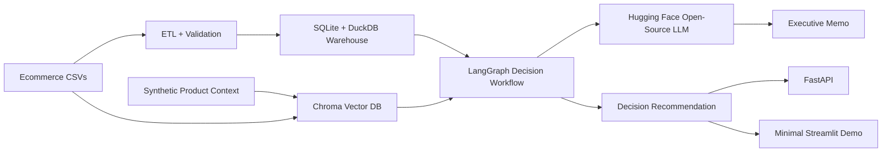

# Architecture

## System Overview

InsightIQ is designed as a GitHub/deployment-first AI Decision Intelligence platform.

## Technology Decisions

- Python is used because the ML/data ecosystem is strongest there and it deploys cleanly on GitHub Actions, Docker, and Render.
- FastAPI is selected for async APIs, typed contracts, OpenAPI generation, and low operational overhead.
- Pydantic provides request/response validation and clear schemas.
- SQLite is used as the portable local warehouse; DuckDB is exported when available for analytical workloads.
- Pandas is used for ETL and analytics; production workloads can move heavy transforms to Spark, dbt, or a cloud warehouse.
- Scikit-learn is used for classical ML without GPU requirements.
- LangGraph StateGraph is used for auditable agent orchestration.
- Chroma is used as the persistent vector DB for reviews, release notes, experiments, incidents, docs, and glossary retrieval.
- Hugging Face InferenceClient is used for open-source LLM generation when `HF_TOKEN` is configured.

## AI Architecture

Agents are separated by responsibility:

- Planner Agent: selects the next workflow step and required tools.
- SQL Agent: writes and validates metric SQL against the warehouse.
- Metrics Agent: computes KPI deltas, funnels, cohorts, and anomalies.
- Review Agent: summarizes customer pain points with evidence.
- Recommendation Agent: maps evidence to launch, iterate, rollback, or investigate decisions.
- Root Cause Agent: connects incidents, releases, experiments, and feature flags to metrics.
- Report Generator: creates the presentation, decision memo, and executive summary.
- Evaluation Agent: measures SQL checks, latency, artifact completeness, and hallucination risk.

Tool calling should be explicit and typed. Each agent receives scoped tools only: SQL readers cannot mutate data, report generators cannot fabricate metrics, and recommendation agents must cite artifact IDs or query outputs.

## API Architecture

Core endpoints:

- `GET /health`: service health.
- `POST /ingest/run`: run ingestion and validation.
- `GET /metrics/summary`: return KPI summary.
- `GET /metrics/funnel`: return Mixpanel-style funnel.
- `GET /reviews/intelligence`: return review themes and sentiment.
- `GET /recommendations/decision`: return final decision memo metadata.
- `GET /reports/presentation`: return generated presentation path.

## Database Architecture

The local deployment uses SQLite and optional DuckDB. Production can use Postgres for app metadata and a warehouse such as BigQuery, Snowflake, or Redshift for analytics. Reviews and documents are indexed in Chroma locally; production can move to managed Chroma, Qdrant, Weaviate, Pinecone, or pgvector.

See [database/schema.sql](/Users/rakesh/Desktop/InsighIQ/database/schema.sql) for tables, keys, indexes, and warehouse design.

## Security

- Authentication: production should use OAuth/OIDC with role-based access control.
- Authorization: workspace, project, and dataset scopes.
- Secrets: environment variables or cloud secret managers.
- Data protection: PII minimization, encryption at rest, TLS in transit.
- AI safety: all generated claims must be grounded in retrieved rows, SQL outputs, or uploaded documents.

## Logging And Monitoring

- Structured JSON logs with trace IDs.
- Metrics for ingestion latency, query latency, token usage, cache hit rate, and agent success.
- Alerts on failed ingestions, model drift, missing artifacts, and elevated hallucination risk.

## Evaluation

The system evaluates:

- SQL execution success.
- Data validation pass rate.
- Artifact completeness.
- Recommendation evidence coverage.
- Review sentiment/topic coverage.
- Latency and throughput.
- Hallucination risk by checking whether report claims cite generated artifacts.

## Cost Optimization

- Cache embeddings by content hash.
- Cache prompts and deterministic report sections.
- Batch review embedding and summarization calls.
- Use local models for simple sentiment/topic tasks.
- Keep warehouse aggregation close to the data.
- Use async IO for API calls and ThreadPoolExecutor for CPU-bound local transforms.
